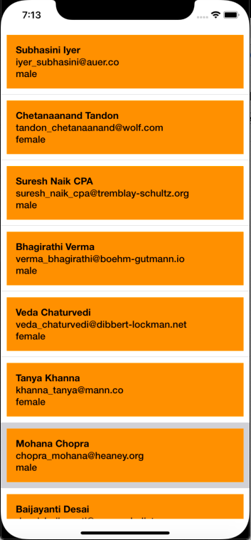

# MVVM-Example


I am using GET API for this demo. I have taken this API from https://gorest.co.in

Here is API : https://gorest.co.in/public/v2/users

Respose : 
```json
[{"id":3444,"name":"Subhasini Iyer","email":"iyer_subhasini@auer.co","gender":"male","status":"inactive"},
{"id":3442,"name":"Chetanaanand Tandon","email":"tandon_chetanaanand@wolf.com","gender":"female","status":"active"},
{"id":3441,"name":"Suresh Naik CPA","email":"suresh_naik_cpa@tremblay-schultz.org","gender":"male","status":"active"},
{"id":3437,"name":"Bhagirathi Verma","email":"verma_bhagirathi@boehm-gutmann.io","gender":"male","status":"active"},
{"id":3436,"name":"Veda Chaturvedi","email":"veda_chaturvedi@dibbert-lockman.net","gender":"female","status":"inactive"},
{"id":3435,"name":"Tanya Khanna","email":"khanna_tanya@mann.co","gender":"female","status":"active"},
{"id":3434,"name":"Mohana Chopra","email":"chopra_mohana@heaney.org","gender":"male","status":"inactive"},
{"id":3433,"name":"Baijayanti Desai","email":"desai_baijayanti@rowe-schulist.org","gender":"male","status":"active"},
{"id":3432,"name":"Pres. Chanda Nambeesan","email":"nambeesan_chanda_pres@satterfield.co","gender":"female","status":"active"},
{"id":3431,"name":"Ramaa Agarwal","email":"agarwal_ramaa@pouros.name","gender":"male","status":"active"},
{"id":3430,"name":"Manik Tandon","email":"manik_tandon@grimes.biz","gender":"male","status":"active"},
{"id":3429,"name":"Ajeet Reddy","email":"reddy_ajeet@white-renner.org","gender":"female","status":"inactive"},
{"id":3428,"name":"Mahesh Johar","email":"mahesh_johar@kshlerin.net","gender":"male","status":"active"},
{"id":3427,"name":"Brahmdev Nayar","email":"brahmdev_nayar@sauer-turcotte.com","gender":"male","status":"active"},
{"id":3426,"name":"The Hon. Leela Iyer","email":"hon_iyer_the_leela@von-bayer.net","gender":"female","status":"active"},
{"id":3425,"name":"Anang Pilla","email":"pilla_anang@okuneva-pacocha.io","gender":"male","status":"active"},
{"id":3424,"name":"Uma Nehru","email":"uma_nehru@mcglynn.io","gender":"male","status":"inactive"},
{"id":3423,"name":"Purnima Desai","email":"desai_purnima@beer.net","gender":"female","status":"active"},
{"id":3422,"name":"Daiwik Devar","email":"daiwik_devar@larson.co","gender":"male","status":"inactive"},
{"id":3421,"name":"Bhanumati Mishra","email":"mishra_bhanumati@kerluke.info","gender":"male","status":"active"}]
```


